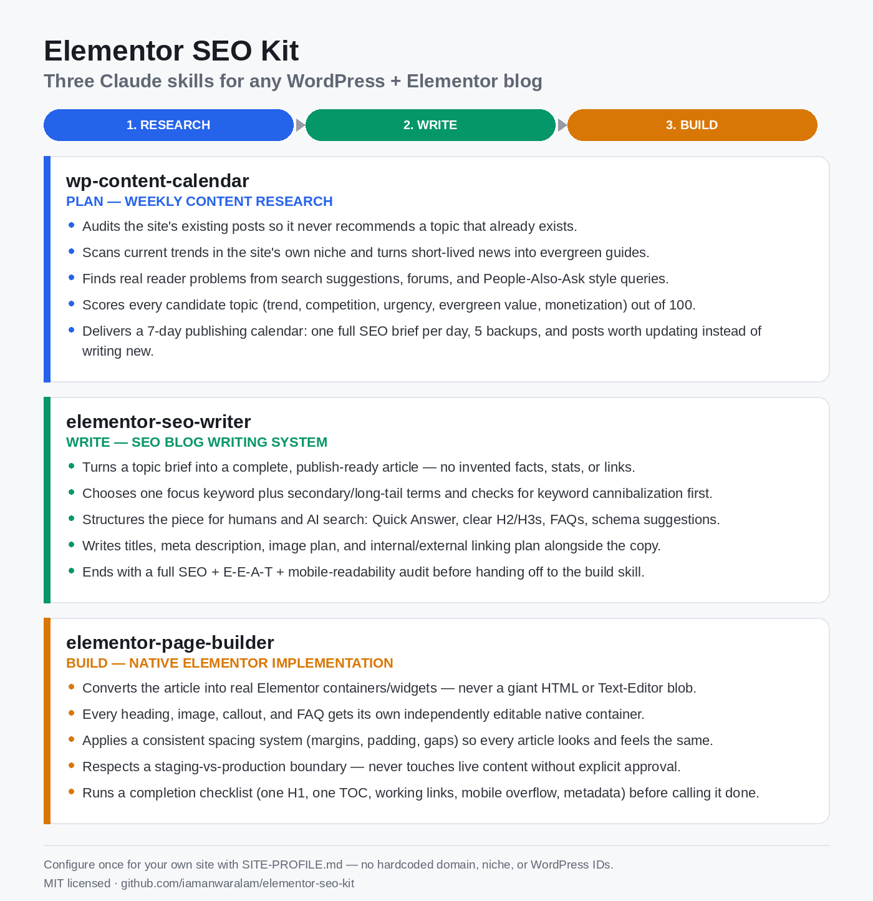

# Elementor SEO Kit



Claude skills for anyone running a WordPress + Elementor blog: weekly content
research, an SEO writing system, and a native-Elementor page-building
workflow — the same three-skill pipeline, generalized for any niche.

These started as private skills built for one specific site. This kit strips
out that site's name, URLs, niche, and any hardcoded WordPress IDs, and
replaces them with a one-time `SITE-PROFILE.md` you fill in for your own
site. Nothing here assumes a particular niche, domain, plugin version, or
post ID.

## What's inside

| Skill | What it does |
|---|---|
| `wp-content-calendar` | Researches your site and its niche, then proposes 7 high-opportunity articles to publish this week, plus posts worth refreshing instead. |
| `elementor-seo-writer` | Writes or rewrites a publish-ready article: research, fact-checking, keyword strategy, metadata, internal/external links, image plan, FAQs, schema, and a full editorial + SEO audit. Outputs clean copy — no HTML. |
| `elementor-page-builder` | Turns that copy into a correctly structured WordPress + Elementor page: native containers/widgets only, one H1, consistent spacing, no duplicate TOC, staging-vs-production discipline, and a completion checklist before anything ships. |

Use them together (research → write → build) or independently.

## Install

### Option A — as a Claude Code / Cowork plugin marketplace

```
/plugin marketplace add iamanwaralam/elementor-seo-kit
/plugin install elementor-seo-kit
```

### Option B — copy the skills directly

Copy the three folders under `skills/` into your own project's or account's
skills directory (e.g. `.claude/skills/`), however your Claude client
expects skills to be installed.

## Set up your site (one time)

1. Copy `SITE-PROFILE.example.md` to `SITE-PROFILE.md` in the project/folder
   you work from.
2. Fill in your site's name, URL, niche, tone, SEO plugin, page-builder
   version, TOC/table plugins, editorial defaults, and current WordPress
   facts (template ID, author, categories, staging vs. production rule).
3. Keep it updated — WordPress IDs and plugin versions change; the skills
   are written to re-confirm these on the live site rather than trust a
   stale value, but a good profile saves a lot of back-and-forth.

If you skip this step, each skill will just ask you for the missing details
before it starts, rather than guessing or reusing an example site's facts.

## Why a profile file instead of hardcoding a site

The original private versions of these skills had one specific site's name,
domain, niche, and WordPress IDs baked in throughout the prompts. That's
fine for personal use, but unusable for anyone else. Every site-specific
fact here has been replaced with an instruction to read `SITE-PROFILE.md`
or ask — so the same skill works whether you run a tech blog, a recipe
site, or a local-services company blog, as long as it's WordPress +
Elementor.

## Requirements

- A WordPress site built with Elementor (free or Pro).
- **[Novamira](https://novamira.ai/)** installed and connected — this is the
  MCP server that actually gives Claude read/write access to your
  WordPress + Elementor site (pages, `_elementor_data`, post meta, Rank
  Math fields, cache clearing, etc.). The three skills in this kit assume
  that connection exists; they govern *what* Claude does with it (content,
  structure, spacing, SEO), not the connection itself. Without Novamira (or
  an equivalent WP-CLI/REST-API/MCP bridge you've wired up yourself),
  `elementor-page-builder` has nothing to act on.
- An SEO plugin (Rank Math, Yoast, or SEOPress all work — the skills say
  "the site's SEO plugin" throughout rather than assuming one).

## License

MIT — see `LICENSE`. Use it, fork it, adapt it for your own site or niche.

## Credits

Originally built for a personal WordPress + Elementor blog by
[Anwar Alam](https://iamanwaralam.github.io/), then generalized for public
use.
